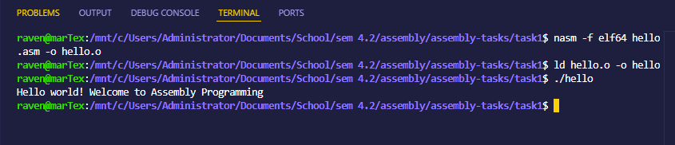
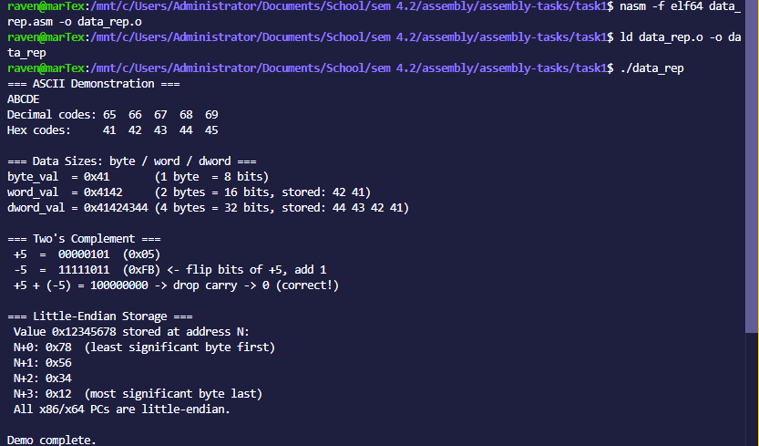

# Task 1 — x86-64 Assembly Programs

Two NASM programs: a Hello World demo and a data representation showcase.

## Prerequisites

- [NASM](https://nasm.us/) assembler
- GNU `ld` linker
- Linux x86-64 (or WSL on Windows)

## Files

| File | Description |
|------|-------------|
| `hello.asm` | Prints a greeting via Linux syscall |
| `data_rep.asm` | Demonstrates ASCII, integers, and other data types |
| `build.sh` | Builds and runs both programs |

## Setup

```bash
# Make the build script executable (first time only)
chmod +x build.sh
```

## Commands

### Build and run everything

```bash
./build.sh
```

### Build individually

```bash
# hello
nasm -f elf64 hello.asm -o hello.o
ld hello.o -o hello

# data_rep
nasm -f elf64 data_rep.asm -o data_rep.o
ld data_rep.o -o data_rep
```

### Run individually

```bash
./hello
./data_rep
```

## Screenshots

### hello



### data_rep


